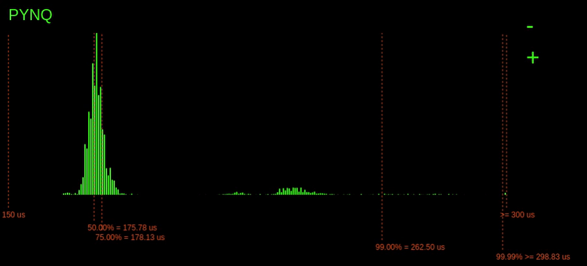
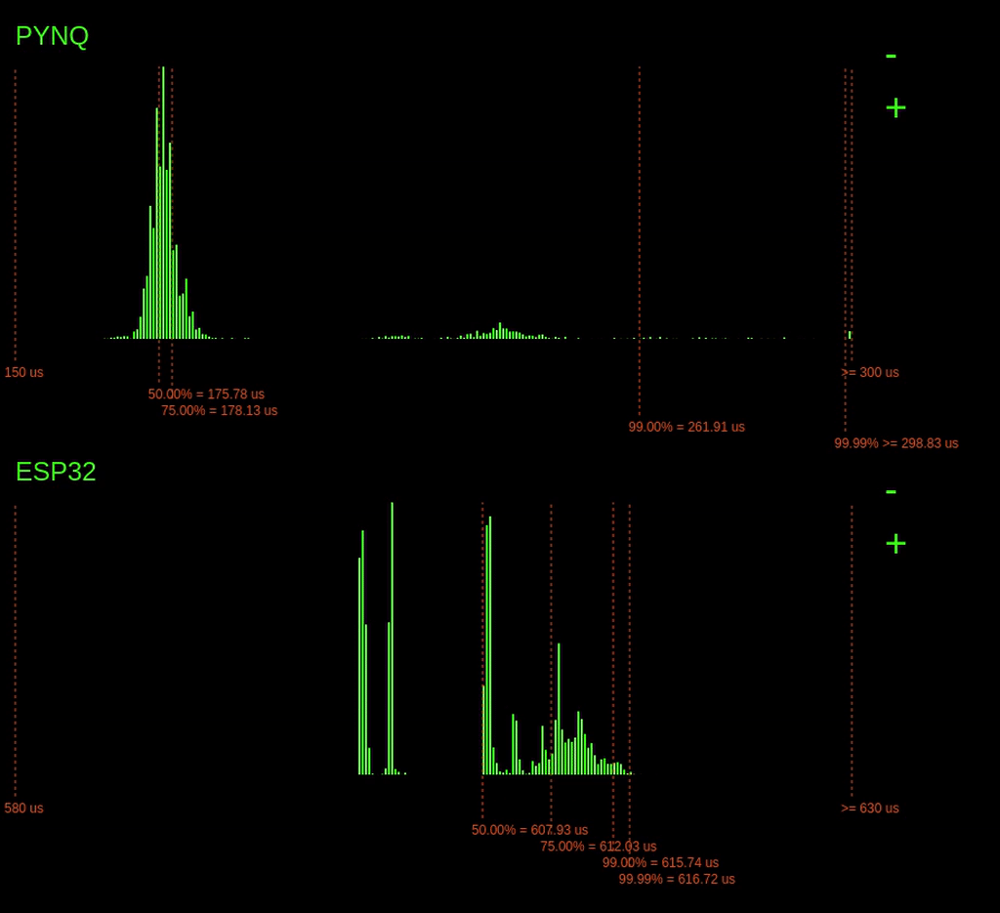
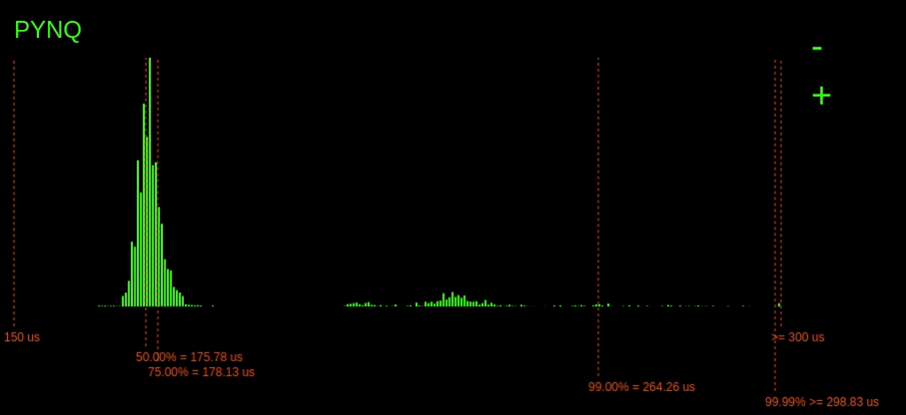

# EmSys: Worst Case Execution Time (WCET) and Real-Time Operating Systems (RTOS)

Imagine you've been asked to design an embedded systems for an aircraft, car, or a medical device.
These are embedded-systems where the operation of the device must be precise and correct.
One _very_ important consideration when designing a system is how long things take to execute.

Imagine you're responsible for designing part of an accelerator control system for a self-driving car. Your subsystem takes in readings from a LIDAR sensor, processes them, and sends the output to the accelerator controller. You may have quite a powerful microcontroller for your subsystem that can comfortably process the sensor data quickly and efficiently without too much trouble. However, if there is even a tiny chance that your system takes longer than it should, then you can have a big problem.

If your subsystem takes too long to process, it may result in a danger to life. Okay, but there are always risks in these things; what if the task's delay is incredibly rare? Even if this is the case, it can present a severe issue. Imagine the self-driving car you are working on is deployed millions of times and runs for ten or more years. Suddenly the probabilities of even those very rare-events are starting to creep up, and any danger to life is unacceptable when we can design to avoid it.

__When designing such embedded systems it is crucial that:__

1. Tasks need to execute with precise timing guarantees
2. Embedded systems need to respond to external events with predictable timings

To make safe embedded systems, we need to ensure that our devices behave predictably concerning timing. To do that, we need to look into where unpredictable delays creep into typical systems and make the execution time non-deterministic.

A deterministic program is usually one where the program's outputted data is the same every single execution. However, with real-time systems, we take a stricter view on determinism and say that:

__The programs outputted data _and the timings of the outputs_ should be the same every execution__

Our desktop computers are throughput orientated machines. They aim to get the most work done in a given time. If we have many tasks, the computer can execute them in an arbitrary order to maximise the most output. Typical machines are also __abstracted__ to hide the system's timings to relieve the programmer's burden. Think about it: when you read or write to a variable in your program, or access a pointer, do you ever need to care how long it takes to fetch it from the memory subsystem? It's all completely invisible to you.

For real-time systems, such as the self-driving car we discussed earlier, timing is essential. This requirement means that different abstractions are required. After looking at the sources of non-determinism in typical computer systems, we will look at something called a Real-Time Operating System (RTOS). An RTOS puts the programmer in control of the timings of tasks.

### Sources of non-determinism

__TODO:__ Include a picture of the stack

Variations in execution time occur at all levels of the computer stack and in many different places. Some examples at various levels are:

1. OS scheduler: when deciding which task to execute when
4. In the Memory Hierarchy: disk -> RAM -> cache L2 -> cache L1
3. I/O: Arbitration and access to busses
5. Internally within the CPU: branch prediction, speculative execution

Let's dig into a few of these in a bit more detail; unfortunately, we don't have time to explore everything that can introduce non-determinism (that would take a while).

### OS Scheduler

Linux uses something called the __Completely Fair Scheduler__ ([CFS](https://en.wikipedia.org/wiki/Completely_Fair_Scheduler)), which we won't go into the details of here. But the basic principles are that we have multiple processes, and the scheduler allocated processes to hardware CPUs trying to give all the processes an equal amount of resources.

The problem with this approach is that it treats all processes equally and fairly. Doing things this way is great for a desktop environment, where we are trying to maximise the throughput of all the processes we have, i.e. do the most work with the limited hardware we have. However, where this approach is a hindrance is when we have tasks that do have higher priority and that have latency requirements over other tasks. 

When we have these sorts of requirements, as we often do with embedded systems, we need a Real-Time Operating System (RTOS) that considers tasks priority. We will go into the RTOS details in a little while.

### Memory Hierarchy

A stark tradeoff exists in computer systems between data storage volume and access speed and cost. Managing the variation in access speeds can cause __huge__ variations in execution time latency.

For instance, SRAM is a high-speed memory that lives very close to the processor; however, usually, it's size is in the order of KBs or MBs. On the other hand, magnetic-disk based hard drives are a glacially slow storage medium, but their size is in the order of TBs.

To put this tradeoff in perspective, let's consider an analogy. Let's say that accessing data from our fast SRAM close to our processor is equivalent to travelling from the Computational Foundry to the Bay Library to check out a book.


Okay, great, that didn't take too long. Now let's say that what we are looking for isn't in our fast SRAM, and instead, we have to go to System Memory (the RAM of our machine). If going to SRAM is the same as travelling to the Library, then going to System Memory is the same as travelling to Bridgend.


Now, say we can't find what we are looking for in system memory (system RAM), we need to start going to solid-state drive (SSD) storage to look for our item. Intel has recently released some blazingly fast SSDs based on a technology called 3D XPoint; let's imagine we're lucky one of these devices. Accessing this is the equivalent to going to Bergen, Norway.


Okay, let's imagine that we are not so lucky, and we just have a standard run-of-the-mill SSD. Instead of travelling to Bergen, we're now travelling to Manilla.


Now, instead of an SSD, consider if we had a magnetic disk-based Hard Disk Drive. Then accessing our data would be the equivalent to travelling 10% of the distance to Mars.

__TODO:__ Picture of a cache

### Internally within the CPU

__TODO:__ Information on speculative execution

## Demonstration

We are going to compare the execution of a benchmark function on two different platforms.

1. An dual-core (800MHz) ARM processor running Linux
2. Our ESP32 (230MHz) device                    

The benchmark we will use is a matrix-vector multiplication, a typical operation used in machine learning applications or signal processing. 

Our benchmark code looks like this:

```C
volatile float rvec [125];
volatile float rmat [125][125];
float res [125];

void compute(){
  for(int i=0; i<125; i++) {
    res[i] = 0.0;
    for(int j=0; j<125; j++) {
      res[i] += rvec[j] * rmat[i][j];    
    }
  }
}
```

15.6K Floating point operations

__TODO: Include a diagram of how matrix-vector multiplication works.__

__TODO: Include a diagram of the experimental setup__

__TODO: Information about the PYNQ setup__



__TODO: Information about the ESP32 setup__



__TODO: Zooming out__


### Pinging the devices a lot


### Logging in via ssh



## Real-Time Operating Systems (RTOS)

* An operating system that enforces timing
* Multi-tasking, but we need tasks to happen at precise times
* Ticks & Tasks
* Ticks break the tasks up into discrete chunks (ABSTRACTION)
* Scheduling: Priorities and Determinism
* Highest priority will starve everything?
* Introduce blocking
* An RTOS will run the highest priority __blocked__ task.
* Blocking: Explicit delays
* Blocking: Blocked on inter-task communications
* Example:
* Example: Hard-coded
* Example: Interrupt-driven
* Limitations with the interrupt-driven approach
* Example: RTOS
* Intertask communications: Overview
* FreeRTOS and the ESP32
